# Moodle-Guidance

## Moodel Kullanim Klavuzu

> "Moodle" kelimesi eglenceli oldugu kadar egitici bir kelime ayni zamanda. En azindan, bu platformun nasil calistigi bilindigi takdirde veyahut belirli bir butona bastiginda ne olacagini biliyorsan yeteri kadar eglenceli olur. Eger bu platformun nasil calistigini kesfetmek istiyorsan, bu klavuz tam sana gore.

---

Moodle online kurs olusturmak, odev vermek ve ogrencilerin gelisimlerini yakindan takip etmeye yarayan online egitim platformudur. Ayrica, bu platform egitimciler ve egitim alanlar ile iletisim kurmaya izin verirken, iletisimin bu gruplar arasinda forum ve tartisma olarak ilerlemesini saglar. Kisaca, bu platform, cok yonlu ve esnek olmasina karsin, ilk kullanirken ogrenim asamasinda karisik gelebilir.

Bu klavuz Moodle ile baslamak icin basit bir sekilde yol gosterir ve egitmen olarak ana baslikta yapilmasi gereken gunluk kullanimda isinize yarayacak bilgileri barindirir. Moodle icerisinde nasil kurs ve test olusturuldugunu, katilimcilarin nasil davet edilecegini, onlara nasil odev atanacagini ve takip edilecegini ogreneceksiniz.

hizlica iki nottan bahsetmek gerekirse;

Not 1: Bu klavuz egitmenler icin tasarlanmis olup, sistem yoneticileri kismini ele almaz.
Not 2: Moodle yuksek derecede ozellestirilmis veyahut istege bagli uyarlanmis bir platform oldugundan dolayi, bu klavuzdan once Moodle platformunu kurduysaniz, sizin portal icerisindeki gorunumunuz ve fonksiyonlariniz biraz farkli olabilir.

### Egitmenler icin Moodle Kullanimi

* Egitmen profilini ozellestirmek
* Online egitim kursu olusturmak
* Aktivite ve Kaynak eklemek
* Egitim alanlari yonetmek

### Egitmen Profilini Ozellestirmek

Egitmen profiliniz, egitimi alan kisilere ve calisma arkadaslariniza mevcut oldugundan oturu, kendinizi tanitmak icin iyi bir firsattir.

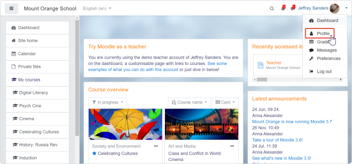

Sag ust kosede **Profile** tikladiktan sonra, kendi kisisel sayfaniza eriseceksiniz ve kisisel bilgilerinizi buradan bicimlendirebilir, fotograf ekleyebilir, tanitim olusturabilirsiniz. Lutfen **Edit Profile** tiklayiniz.

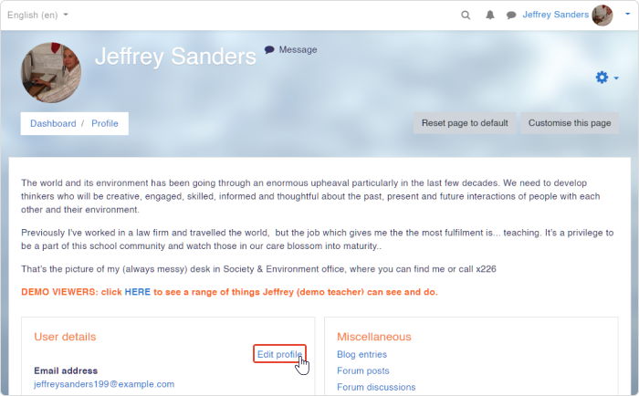

Burada, kendiniz hakkinda yazi yazabilir veya istege bagli olarak video kaydi paylasabilirsiniz, fotografinizi ekleyebilir ve irtibat bilgilerini paylasabilirsiniz.

### Online Egitim Kursu Olusturmak

Default olarak, Moodle egitmenlerin ( sistem icerisinde tanimlanmis rol anlaminda) yeni kurs eklemelerine olanak tanimiyor. Bu baglamda, Moodle'in icerisindeki kullanici rollerine hizlica goz atabiliriz.

- **Administrator** sistem ile her seyi yapabilen yoneticidir.
- **Manager** admin ile benzer yetkilere sahiptir ancak rolu ve yetkileri uyarlanabilir.
- **Course Creator** yeni kurs olusturur.
- **Teacher** kurs icerigi ve aktivite ekleyip, duzenleyebilir.
- **Student** mevcut kurslara erisim saglar.

Eger egitmen iseniz, admin veya manager ile iletisime gecip, kurs olusturma izni isteyebilirsiniz veya sizin icin bos bir kurs olusturmasini talep edebilirsiniz. Ornek olarak, asagidaki demo uzerinden egitmen gorunumu ile dokuz kursun admin tarafindan atandigini gorebilirsiniz.

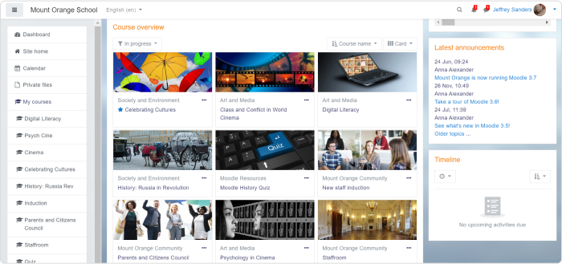

Olusturulan bu kurslar ile, neredeyse her seyi yapabiliriz; yeni unite olusturabilir, onlari silebilir, quiz ve kaynakcalar ekleyebilir veya not sistemi kurabiliriz. Kursun icerigini hazirlamaya baslamak icin, sag ustte yer alan ikona tiklayip, **Turn editing on** secenegini secmeliyiz. Eger, egitmen olarak, boyle bir opsiyonunuz yok ise, admin ile iletisime gecebilirsiniz.

### Kurs Yapisi Nasil Olusturulur

Moodle'in icerisinde dort farkli kurs formati bulunmaktadir:

- **Single activity format** calisma icin tek bir aktivite veya kaynak barindiginda uygundur. Ornek olarak; anket, kitap veya video dersi gosterilebilir. Ayrica, bu formati SCORM paketiniz varsa secebilirsiniz.

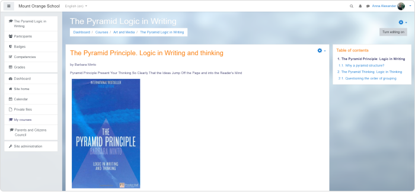

- **Topics format** iceriginizi farkli bolumler halinde organize etmenizi saglar. Ornek olarak; dersler ve uniteler verilebilir.

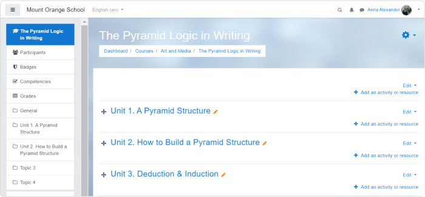

- **Weekly format** topic formatina benzerlik gosterir, fakat uniteler yerine haftaliklar olacaktir. Bu opsiyon, ogrenci icin duzenli bir tempoda egitim vermek isterseniz, guzel bir secenektir.

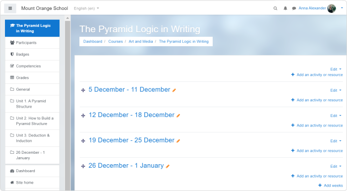

- **Social format** size geleneksel unite yerine forum formatini sunar. Eger resmi olmayan bir egitim methodu secerseniz, bu guzel bir opsiyondur ve egitim alanlar arasinda tartisma ortami dogurur.

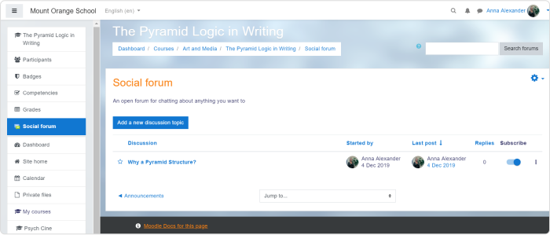

Boylece, sizin icin olusturlmus olan bos kursu, bu sekilde egitim icerigi ve aktivite ile doldurabilirsiniz. Sag ustte bulunan ayarlar ikonuna tiklayiniz ve "editing modu" 'u aciniz.

Bunu yaptiktan sonra, tekrardan, **Edit settings** 'i acilir menuden seciniz.

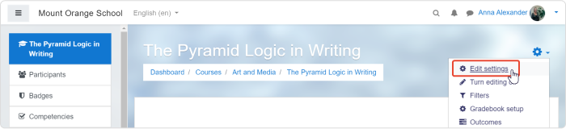

Asagi kaydirin ve **Course format** kisminda formatinizi secin ve sayfanin en altinda bulunan **Save and display** butonuna tiklayin.

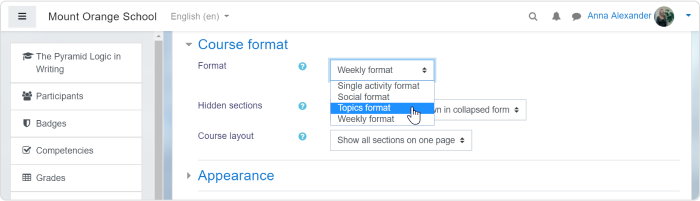

### Aktivite ve Kaynak Eklemek

Moodle dilinde, aktiviteler ogrencilerin egitimleri interaktif bir sekilde ogrenmesini saglar. Quizler, forumlar, odevler genelde aktivite olarak degerlendirilir.

Kaynaklar ise, egitimin icerigini arttirmak icin kullanilan ogelerdir. Dokuman veya sunum olabilir, hatta, YouTube gibi harici websitelerinden alinan ogeler bile dahil edilebilir.

Aktivite ve kaynak eklemek icin, sag ustte bulunan ayarlar ikonundan "editin mode" acilmali. Editin mode etkinlestirildikten sonra, **+ Add an activity or resource** seceneginin mevcut oldugunu goreeksiniz. Bu secenege tiklayip, acilan pencerenden uygun opsiyonlar secilmelidir. 14 farkli aktivite ve 7 farkli kaynak oldugunu goreceksiniz.

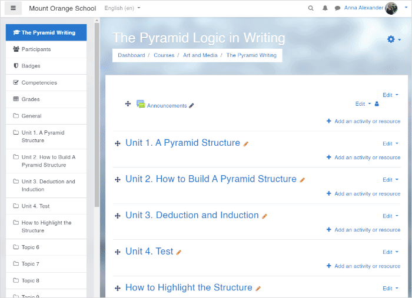

Tercih ettiginiz aktivite veya kaynagi sectikten sonra, **Add** butonuna tiklayiniz.

### Quiz Nasil Eklenir

Eger quiz eklemek istiyorsaniz, **+ Add an activity or resource** sekmesine tiklayip, acilan pencereden **Quiz** secenegini secmelisiniz. Bunu yaptiktan sonra, quiz ayarlar menusu gelecektir.

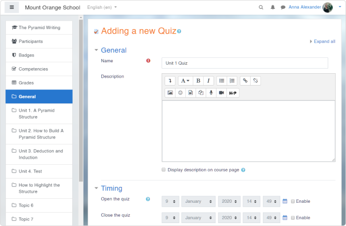

Quiz ismini doldurunuz. Daha sonra, **Save and return** 'e tiklayabilirsiniz, cunku bos olan pencereden doldurulmasi mecburi olan tek kisim quiz ismidir. Bununla beraber, bu menudeki diger ayarlara goz atmaktan cekinmeyin. Ornek olarak, belli bir zaman ayari yapabilirsiniz veya quiz'in deneme sayisina limit getirebilirsiniz.

Daha sonraki adim ise, bos olan quiz sayfasini sorular ile doldurabilirsiniz. Acilan yeni pencerede, **Add** butonuna ve **+ a new question** tiklayin.

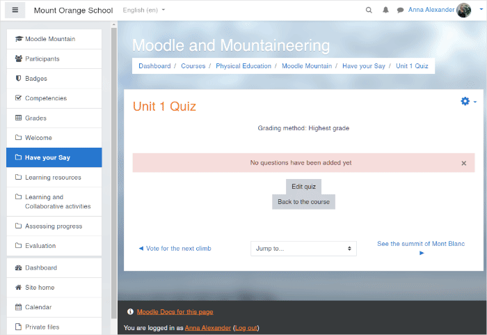

Moodle icerisinde, kullanabilcegimiz 15 farkli soru tipi mevcut; coktan secmeli sorular, eslestirme ve surukle birak sadece birkac tanesi. Kullanmak istediginiz soru tipini secin ve **Add** butonuna tiklayiniz.

### Odev Nasil Eklenir

Odev olusturma egitmen olarak siklikla kullanacaginiz bir ozellik. Guzel bir geri donusum almak icin ogrencilerden odev yuklemelerini isteyebilirsiniz ve egitim nasil gittigini degerlendirebilirsiniz.

Daha onceden quiz bolumunde gosterildigi gibi,  **+ Add an activity or resource** sekmesine tiklayip, acilan pencereden **Assignment** secenegini secmelisiniz.

Yeni penderede, odevin ismini yazmalisiniz ve ogrenciden spesifik olarak ne bekledigini belirtmelisiniz. Ornegin, bir video izlemelerini soyleyip, onun hakkinda tasvir bolumunde yorumda bulunmalarini, fikirlerini sunmalarini isteyebilirsiniz.

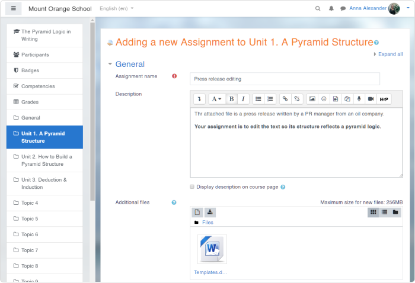

Odev aktivitesinde bir cok yararli ayarlar yapilabilir. Bazilari ise sunlardir;

#### Availability

Bu kisimda, odevin yuklenmesi icin gerekli sureyi ayarlayabilir veya ogrencilere odev teslim gunu gelmeden hatirlatici ayarlayabilirsiniz.

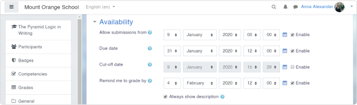

#### Submission types

Bu kisimda, ogrencilerin odevi yuklerken uygulamasi gereken spesifik formati ayarlayabilirsiniz. Eger, ogrencilerin direkt olarak Moodle icinde cevap vermesini istiyorsaniz, "Online text"i seciniz. Dosya yuklemelerini istiyorsaniz "File submission" secenegini secebilirsiniz.

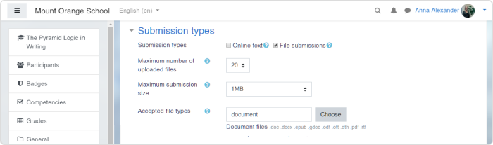

Eger, ayarlari yaptiysaniz ve tamamsaniz sayfanin altinda bulunan **Save and return to course** butonuna tiklayiniz.

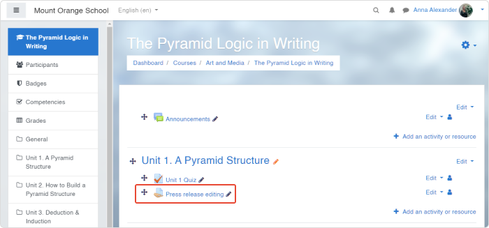

## Egitim Alanlari Yonetmek

Egitiminiz, kursunuz hazir ve iceriginizi kesfetmeleri icin ogrencileri davet etme zamani.

Ilk olarak, kayit methodlarini ayarlamaliyiz. Kurs icerisinde, sol tarafta bulunan **Participants** sekmesini secin, sag ustte bulunan ayarlar ikonuna tiklayin ve **Enrolment methods** 'a tiklayiniz.

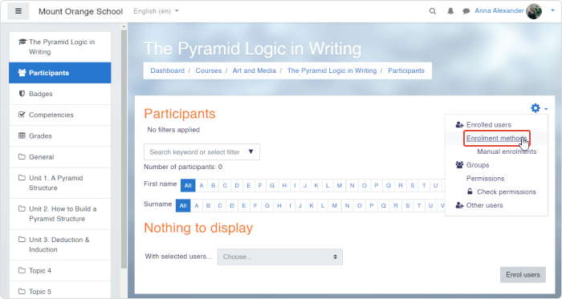

3 farkli kayit methodu var:

- Manual Enrolment
- Guest access
- Self Enrolment

Default olarak, manual kayit opsiyonu sunulmaktadir. Eger guest enrolment veya self enrolment secenegini aktif hale getirmek istiyorsaniz, goz ikonuna tiklayiniz. Goz ikonun yanindaki yanindaki ikona tiklayarak, kayit suresi, kayit sifresi veya max katilimci gibi opsiyonlari da ayarlayabilirsiniz.

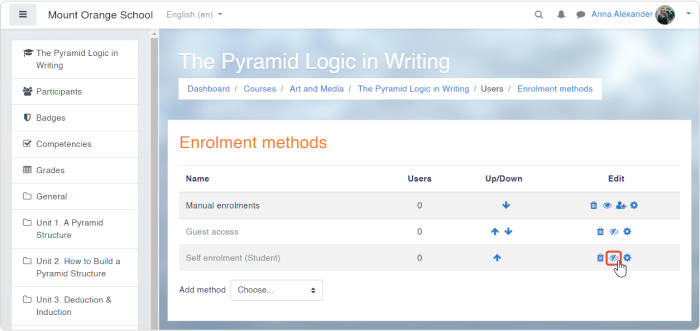

### Ogrencileri Kursa Nasil Kayit Edebiliriz

Genellikle, egitimciler kullanicilari sisteme eklemek zorunda kalmazlar, cunku kullanici lsitesi admin veya manage tarafindan yuklenmis olur. Bu sebepten oturu, sol taraftaki menuden **Participants** seciniz. Buradan sag tarafta bulunan **Enrol users** tiklayiniz. daha sonra, acilan pencereden "select users" icerisnde bulunan listeden kullanici secebilirsiniz.

Eger tamamsaniz, **enrol selected users and cohorts** tiklayiniz.

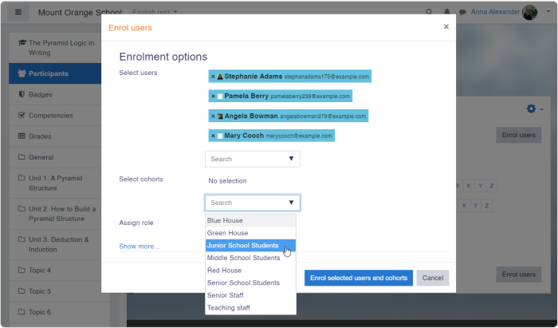

### Gruplar Nasil Olusturulur

Daha elverisli olma adina, kayit olan kullanicilari gruplara ayirabilirsiniz. Bu ozellik, ayni dersi farkli siniflara anlatmak durumundaysaniz sizin icin cok faydali olacaktir.

Gruplari olusturmak icin, sag ustte bulunan ayarlar ikonuna tiklayiniz, ve **Groups** seciniz.

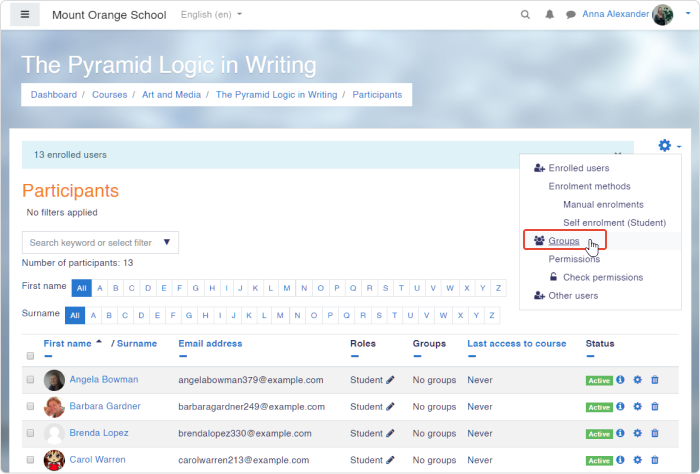

Acilan yeni pencereden asagi kaydiriniz ve **Create group** tiklayiniz. Bundan sonra, group ismini girebilir, fotograf ayarlayabilir ve group mesaji olusturabilirsiniz. Daha sonra, **Save changes** tiklayiniz.              

Acilan yeni pencereden, sag tarafta listelenmis kullanicilari secebilir ve grouplara ayirabilirsiniz.

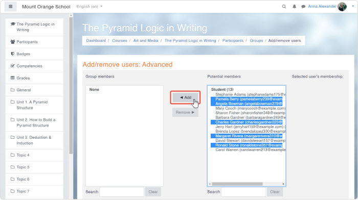

### Ogrencilere Mesaj Nasil Atilir

Moodle egitim alanlarla veya calisma arkadaslariyla iletisim kurmaya olanak saglar. Ekranin ust kisminda, dusunce baloncugu sembolu bulunmaktadir. Bu ikon rehber listesini acar.

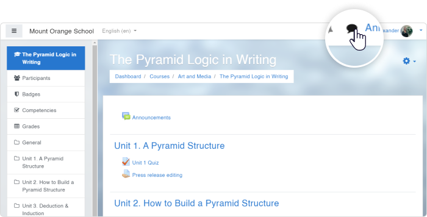

Boylece, kullanicilara veya gruplara ozel mesajlar atabilirsiniz ve bu hizlica bir seyi danismak icin guzel bir opsiyondur.

### Not Defteri Nasil Kurulur

Moodle icinde bulunan not defteri ozelligi, ogrencilerin aktivitelerden aldigi puanlari degerlendirmeyi saglar. Ayrica, egitmen olarak notlari manual olarak girebilir, gorebilir ve degerlendirebilirsiniz.

Kurs icerisinde not defterini olusturmak icin, sag tarafta bulunan ayarlar ikonuna tiklayiniz, **Gradebook setup** seciniz. Yeni pencerede, kurs icin puanlanmis tum listeyi gorebilirsiniz.

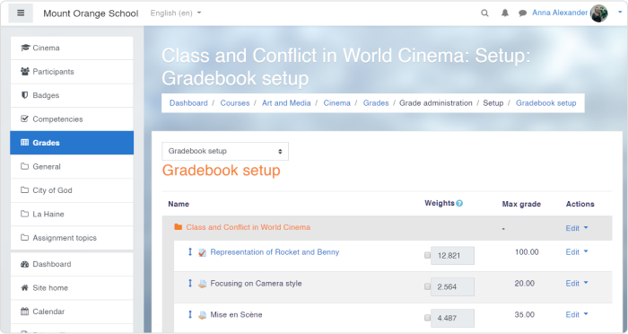

Eger ki, not defteri itemlerini daha organize gormek istiyorsaniz, aktiviteleri kategorilere ayirabilirsiniz. Ekrani asagi kaydirin ve **Add category** tiklayiniz. Demo kursta, biz 3 farkli puanlanmis kategori kullaniyoruz:

- Assignment
- Quiz
- Simulation

Sizin kendi kursunuzda, istediginiz kadar kategoriye sahip olabilirsiniz. "Add category" tikladiktan sonra, olusturulan her bir kategoriye isim veriniz ve **Save changes** tiklayiniz.

Boylece ogeleri ok isaretine tiklayarak, kategorilerine gonderebilirsiniz.

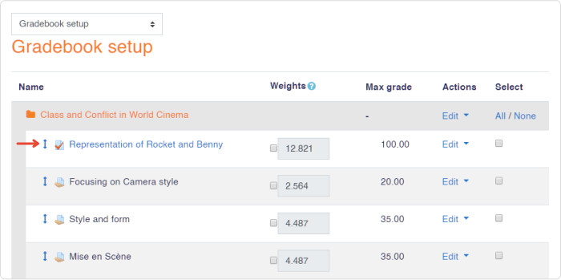

Ogeleriniz organize olduktan sonra, balans notlarinizi atamak daha kolay. Mesela, ev odevi kategorisi daha onemli ise bu kategorinin balans notu daha yuksek olur. Eger notu 50 ise, checkbox'i isaretleyin ve 50 giriniz.

Diger tum balans notlari otomatik olarak ayarlanacaktir. Diger kategorilerin notlarini da siz ayarlayabilirsiniz tabii.

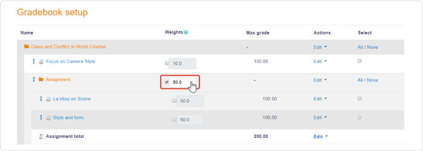

### Egitim Alanlarin Notlarini Nasil Puanlariz

Ev odevlerini degerlendirmek icin, baslamak istediginiz bor odevi seciniz. sol taraftaki menuden **Grades** secenegini seciniz ve degerlendirmek istediginiz aktiviteyi seciniz.

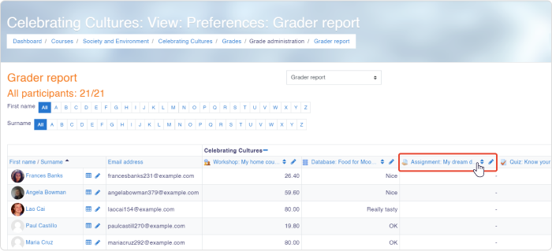

"Grading summary page" kismina iki farkli yol ile ulasabiliriz; **View all submissions** veya **Grade**.

**View all submissions** tikladiktan sonra, kayit olan kullanicilarin listesini ve teslim ettikleri odevleri goreceksiniz.

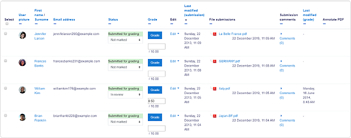

**Grade** tiklayarak bazi ogrencilerin odevlerini inceleyebilirsiniz.

Not degteri arayuzu, dip not birakmaniza, aciklama yapmaniza, renkli isaretleme yapmaniza olanak saglar. Sag panelde bulunan **Enter the grade** tiklayarak teslim edilen odevi notlayabilirsiniz, sonra, **Save changes** ve **Save and show** tiklayarak sonlandirabilirsiniz.

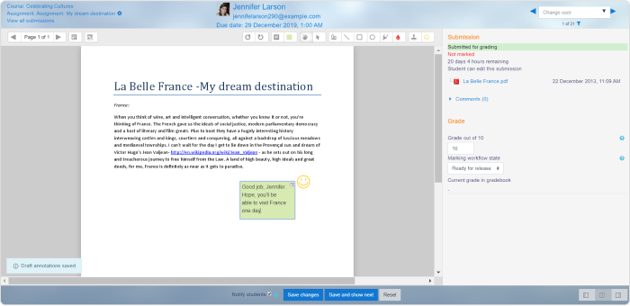
